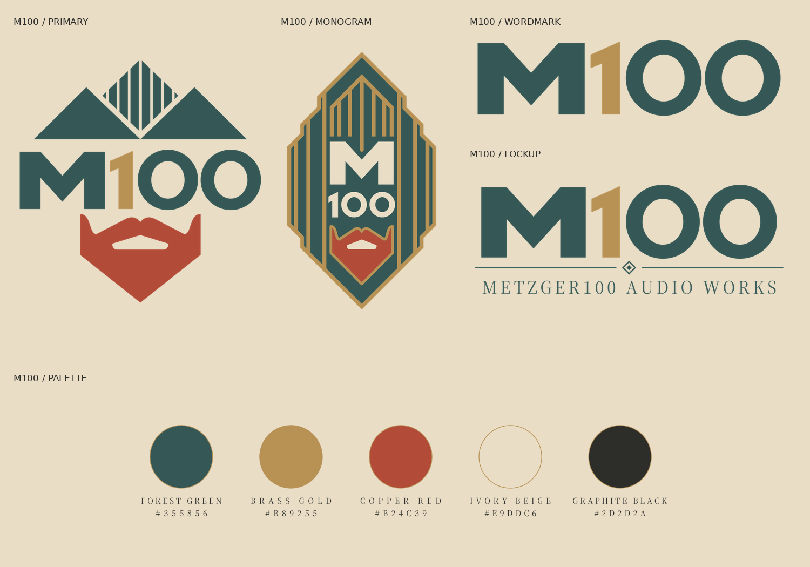

# METZGER100 AUDIO WORKS

  

**Audio electronics & acoustics.** Audio equipment with precision and purpose.

> **Precision. Character. Built to last.**

Purposeful engineering, documented decisions and serviceability guide each design, from the signal path to the sound in the room.

[Repository](../README.md) · [Families](#brand-architecture) · [Model naming](#model-designations) · [Visual identity](#visual-identity) · [Artwork](design/README.md)

## Brand architecture

- **Manufacturer:** METZGER100 AUDIO WORKS
- **Signet / product brand:** M100
- **Intended scope:** Microphones, preamps, amplifiers, loudspeakers and other audio equipment.

Families express design intent across equipment types. Family descriptions and model examples are naming guidance, not released hardware; see [current projects](../README.md#projects) for actual readiness.

| Family | Character and application | Family line |
| --- | --- | --- |
| **M100 MERIDIAN — Reference** | Precise, spacious and versatile. Natural capture, clean signal handling and accurate reproduction for ensembles, acoustic instruments, speech, stereo recording and listening. | **Open. Precise. Natural.** |
| **M100 VESPER — Voice** | Intimate, smooth and slightly warmer. Thoughtful voicing for voiceover, vocals, acoustic solos and close, attentive listening. | **Intimate. Warm. Refined.** |
| **M100 ATLAS — Performance** | Rugged and direct, with useful headroom and reliable operation. For live performance, loud instruments, mobile recording, rehearsal and sound reinforcement. | **Direct. Controlled. Powerful.** |
| **M100 REGENT — Signature** | The flagship family: especially refined engineering, acoustics, mechanics and operation for demanding recording and listening systems. | **Grand. Elegant. Distinctive.** |

## Model designations

**M100 + family + equipment identifier + technical variant**, e.g. **M100 Meridian MIC-26-M**. The emotional name remains prominent; the equipment identifier makes the technical suffix unambiguous.

| Identifier | Equipment | Number | Configuration |
| --- | --- | --- | --- |
| **MIC** | Microphone | Approximate capsule diameter in mm | **C** cardioid; **O** omni; **F** figure-eight; **M** multi-pattern |
| **PRE** | Preamplifier | Signal channels | **MIC** microphone; **LINE** line; **PHONO** phono inputs |
| **AMP** | Amplifier | Amplifier channels | **PWR** power; **INT** integrated; **INST** instrument |
| **SPK** | Loudspeaker | Acoustic ways | **A** active; **P** passive |

| Example | Description |
| --- | --- |
| **M100 Meridian MIC-26-M** | Reference microphone; approx. 26 mm capsule, multi-pattern |
| **M100 Vesper MIC-23-C** | Voice microphone; approx. 23 mm capsule, cardioid |
| **M100 Meridian PRE-2-MIC** | Reference two-channel microphone preamp |
| **M100 Atlas AMP-2-PWR** | Performance two-channel power amplifier |
| **M100 Regent AMP-2-INT** | Signature two-channel integrated amplifier |
| **M100 Meridian SPK-2-A** | Reference two-way active loudspeaker |
| **M100 Regent SPK-3-P** | Signature three-way passive loudspeaker |

On hardware, emphasise **M100** and the **family name**; place the suffix discreetly below or on the model label. Use full designations in manuals and ordering information. Keep revisions and serial numbers separate; reserve each complete designation for one model/configuration. Document identifiers for additional equipment types when needed.

Capsule diameter and active diaphragm diameter are distinct; state the size convention. Speaker ways count acoustic divisions, not physical drivers.

## Visual identity

**Art Deco + European studio equipment + modern precision.** Retain the mountain, beard and custom M100 lettering; keep controls and functional labels clear.

| Colour | Hex |
| --- | --- |
| Forest Green | `#355856` |
| Brass Gold | `#B89255` |
| Copper Red | `#B24C39` |
| Ivory Beige | `#E9DDC6` |
| Graphite Black | `#2D2D2A` |

| SVG master | Use |
| --- | --- |
| [Primary logo](design/m100-primary.svg) | Introductions and packaging |
| [Monogram](design/m100-monogram.svg) | Vertical badges |
| [Wordmark](design/m100-wordmark.svg) | Compact panels |
| [Manufacturer lockup](design/m100-lockup.svg) | M100 plus the full brand name |
| [Palette](design/m100-palette.svg) | Colour reference |

- **Backgrounds:** Standard artwork on Ivory and Graphite; `-inverse.svg` variants on Forest Green. The monogram is identical on all three.
- **Production:** [Graphite](design/m100-wordmark-mono.svg) or [Ivory](design/m100-wordmark-mono-inverse.svg) single-colour wordmarks for engraving, panel printing and PCB markings. Preserve proportions, spacing and flat colours; use the wordmark at small sizes.

## Voice and status

Write precisely, calmly and confidently. Explain purposeful sonic choices; support performance claims with measurements and distinguish design aims from results.

Current research: [M100 Meridian condenser microphone](../meridian/README.md). The family descriptions and model examples define the architecture; actual configurations follow each project's design decisions.

[Artwork specifications](design/README.md) · [Artwork preview](design/preview.html) · [Naming details](proposals/product-naming.md)
