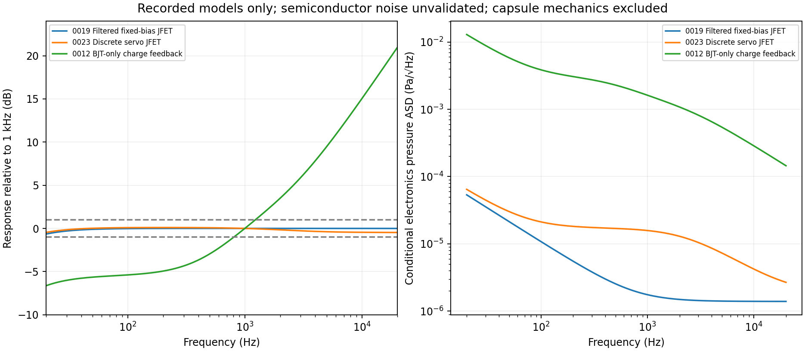
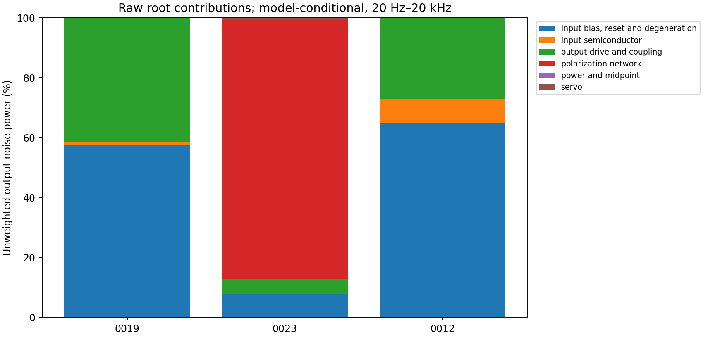
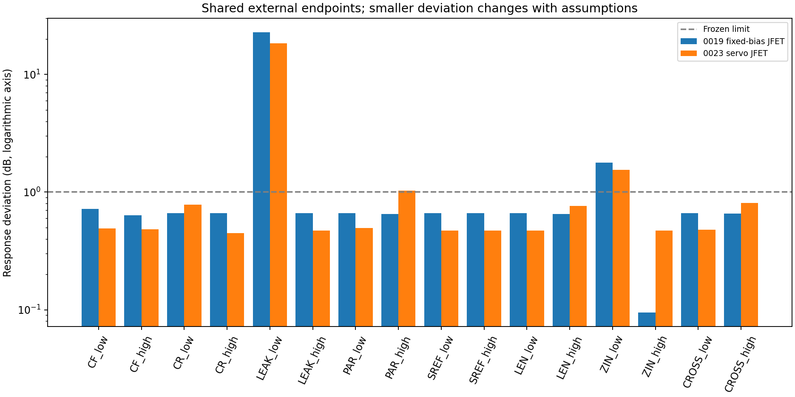
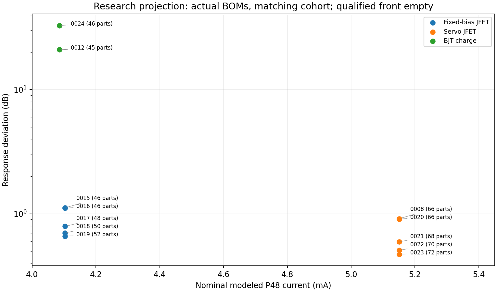

<!-- SPDX-License-Identifier: CERN-OHL-S-2.0 -->
# Meridian architecture comparison 001 — 9 October 2026

**No tested implementation is compelling enough for a prototype selection.** The filtered fixed-bias JFET and discrete servo JFET provide useful, different nominal response results, but miss noise/output or adverse-case requirements and lack validated device populations and nonlinear evidence. The BJT-only charge implementation has a demonstrated conversion/bandwidth problem. Guarded CMOS and CMOS charge integrations fail numerically. The carrier family has an isolated conversion control, but its integrated DUT and periodic noise/power remain unsupported.

This is an intermediate comparison for M100 Meridian MIC-34-M/MIC-34-C with **Arienne Audio Flat K47 Cardioid/Omni K47FRB under P48**. No topology, PCB, physical prototype or production winner is selected. There are no physical measurements. Nominal rear pressure is zero; neither microphone variant's acoustic pattern is qualified. Physics/measurements → SPICE → automated tests → numerical optimization → engineering reasoning → LLM intuition remains the evidence hierarchy.

[Contract](../CONTRACT.md) · [unchanged specification](../spec/microphone_spec.yaml) · [capsule assumptions](../spec/capsule_model.yaml) · [components](../../../COMPONENTS.md) · [patents](../../../PATENTS.md) · [measurement priorities](../measurement/priority_plan.md) · [dated comparison plan](architecture_comparison_001.yaml).

## Audit, comparison scope and reproducibility

The [device validation audit](device_model_validation.md), [first batch](first_architecture_batch.md), [optimization report](robust_optimization_report.md), original optimizer trials and full-suite/withheld records were inspected before reporting. Later work already supplies six implemented mechanisms, fifteen first-batch implementations, nine robust children and six budgeted optimization records. Catalogue-only concepts are retained as proposals, not populated with invented metrics. All fourteen families remain in [the family register](../search/families.yaml).

The [comparison generator](compare_architectures.py) verifies **17 full-suite records and six optimizer records**, frozen source/implementation/deck/raw hashes and same-cohort nominal data. Its initial rendering verifies **9,117 distinct declared files**. It makes no new SPICE evaluations: the finite additional analyses are raw noise contribution integration, shared-endpoint pairing, linear sensitivity rescaling, netlist connectivity extraction and scoped research Pareto projections. Repeating the known unresolved model/nonlinear failures would not establish the missing behavior. Frozen parents, raw failures, seeds and original inventories are unchanged.

All 17 full-suite attempts share specification SHA256 `f5201295bef7855bced5157cf9727f95d057c2b17589f9f55b8fd6fb17445bbd`, suite SHA256 `75bea8b0ca5302a3b1906d41931149133244dd75b1572f52c557cd7a9ab84df5`, backend **ngspice 47**, and the same complete source manifest. Per-model identities differ intentionally by device family; those differences and their validation limits are explicit. Numerical optimization has an earlier source cohort and is used only as proposal ancestry, not pooled performance. Python 3.12.14, NumPy 2.4.2, SciPy 1.17.1 and recorded solver settings remain in each run. The generator pins its own inputs/outputs and verifies the original hashes in [provenance.json](../results/reports/architecture_comparison_001/provenance.json).

Reproduce from the laboratory directory:

```sh
.venv/bin/python research/compare_architectures.py
./run verify
```

Regeneration requires the original local waveforms/vendor snapshots. A fresh Git clone lacks those bytes; reacquisition or reruns cannot recover the original evidence. Read [the storage boundary](../results/README.md). Committed plots and compact tables remain usable without regeneration.

Deliverables: [machine-readable comparison](../results/reports/architecture_comparison_001/architecture_comparison_001.json), [generated tables and complete BOMs](../results/reports/architecture_comparison_001/tables.md), [nominal CSV](../results/reports/architecture_comparison_001/nominal_metrics.csv), [all check statuses](../results/reports/architecture_comparison_001/qualification_coverage.csv), [BOM line CSV](../results/reports/architecture_comparison_001/bom_lines.csv), [noise spectra](../results/reports/architecture_comparison_001/noise_spectra.csv), [contributions](../results/reports/architecture_comparison_001/noise_contributions.csv), [harmonic/headroom availability](../results/reports/architecture_comparison_001/harmonics_headroom.csv), [shared endpoints](../results/reports/architecture_comparison_001/paired_endpoints.csv), [sensitivity derivation](../results/reports/architecture_comparison_001/sensitivity_rescaling.csv).

## Representatives and exact identities

“Representative” means the strongest supported result for a stated niche or the most complete tested implementation of a held mechanism. It does not assert globally optimal or equally qualified architectures. Lower-count alternatives remain visible.

| Representative / evidence state | Exact experiment | Frozen netlist / actual research BOM | Faithful netlist diagram |
| --- | --- | --- | --- |
| candidate_0019, filtered fixed-bias JFET; best tested realized response in that niche | [20261009T090737Z_40e6a493](../results/runs/20261009T090737Z_40e6a493/results.json) | [netlist](../results/runs/20261009T090737Z_40e6a493/circuit.cir) / [BOM](../results/runs/20261009T090737Z_40e6a493/bom.yaml) | [connectivity](../results/reports/architecture_comparison_001/candidate_0019_connectivity.svg) |
| candidate_0023, discrete servo JFET; best tested realized response in that niche | [20261009T090930Z_1acba093](../results/runs/20261009T090930Z_1acba093/results.json) | [netlist](../results/runs/20261009T090930Z_1acba093/circuit.cir) / [BOM](../results/runs/20261009T090930Z_1acba093/bom.yaml) | [connectivity](../results/reports/architecture_comparison_001/candidate_0023_connectivity.svg) |
| candidate_0012, BJT-only charge feedback; ordinary-passive DC-authority descendant | [20261009T090439Z_c6d23a08](../results/runs/20261009T090439Z_c6d23a08/results.json) | [netlist](../results/runs/20261009T090439Z_c6d23a08/circuit.cir) / [BOM](../results/runs/20261009T090439Z_c6d23a08/bom.yaml) | [connectivity](../results/reports/architecture_comparison_001/candidate_0012_connectivity.svg) |
| candidate_0010, guarded CMOS; real-input integration hold | [20261009T090436Z_496da267](../results/runs/20261009T090436Z_496da267/results.json) | [netlist](../results/runs/20261009T090436Z_496da267/circuit.cir) / [BOM](../results/runs/20261009T090436Z_496da267/bom.yaml) | [connectivity](../results/reports/architecture_comparison_001/candidate_0010_connectivity.svg) |
| candidate_0014, CMOS charge; C0G realization/integration hold | [20261009T090439Z_77e9f0c9](../results/runs/20261009T090439Z_77e9f0c9/results.json) | [netlist](../results/runs/20261009T090439Z_77e9f0c9/circuit.cir) / [BOM](../results/runs/20261009T090439Z_77e9f0c9/bom.yaml) | [connectivity](../results/reports/architecture_comparison_001/candidate_0014_connectivity.svg) |
| candidate_0013, floating carrier bridge; ideal-block mechanism control, integrated transient failure | [20261009T090547Z_1f85c513](../results/runs/20261009T090547Z_1f85c513/results.json) | [netlist](../results/runs/20261009T090547Z_1f85c513/circuit.cir) / [partial BOM](../results/runs/20261009T090547Z_1f85c513/bom.yaml) | [connectivity](../results/reports/architecture_comparison_001/candidate_0013_connectivity.svg) |

Diagrams are complete element/node graphs extracted from these frozen netlists, with nominal parameter values and macro pin order. Only zero-volt current-observer nodes collapse. Macro internals remain opaque. They are research diagrams, not wiring/assembly instructions. Each matching `*_connectivity.csv` retains original lines, uncollapsed node order and values; B/E ideal sources remain visible.

Exact model files: `jfe150_pspice`, TI Final 1.2/SLPM349I, SHA256 `6d8772027157841c7f659cf2c1f72f0818155e204c74158f7f52710609a61ef6`; `bc846b_emitter_r1`, authored one-node emitter correction, SHA256 `55c70791f338fe882c652ced258d28990827988e62c929f302d5f1193565411d`; `opa197_pspice`, Final 1.3/23 June 2022/SBOMA34D, SHA256 `fc5b020e63346e511bd808bf41c856b0150b000bcf8a41fe00eeececb1f422a5`. JFET representatives use the first two; BJT and carrier power use the second; CMOS representatives use the second and third. All vendor ancestry, acquisition dates and versions are in the machine-readable identities. Vendor redistribution permission remains unresolved.

JFE nominal gm is below the guaranteed minimum, its current-noise prediction disagrees with typical evidence, and weak/strong files fail library limit checks. The BC846B correction is not vendor approved; capacitance/noise-factor agreement and 1/f/process/SOA coverage remain incomplete. OPA197 supports restricted grounded small-signal controls, not these floating integrations. No complete validated device set supports production-bounded cross-family noise or no-selection yield. Omitted behavior receives no favorable zero or performance credit.

## Power, sensing and no-selection strategy

The common power network harvests both microphone XLR legs through 2.2 kΩ resistors into a raw node, with 47 µF storage and a 100 kΩ/100 kΩ base divider driving a BC846B emitter-follower rail. A separate midrail divider/filter supplies signal references. Ten series ordinary 1 MΩ resistors realize the 10 MΩ polarization filter; a final 1 MΩ feeds the backplate. Loaded rail and electrode voltages are computed with P48 feeds, cable and preamp attached. Device terminal-current/KCL and energy-closure records support nominal power accounting; they do not establish thermal/SOA or hot-plug safety. Output branches use 47 Ω and real coupling capacitors, plus finite preamp/cable loading. No protection-complete implementation exists.

**0019:** JFE150 source follower senses front-electrode voltage. A fixed rail/4 divider returns the gate through 1 GΩ; 3.3 kΩ source degeneration sets bias without specimen selection. A 100 nF PET filter after the last backplate-feed resistor tests the previously dominant polarization noise. A real NPN follower and emitter-degenerated NPN phase inverter/follower produce opposite output signals, with unequal finite impedances retained. Five active packages/47 physical passives; the eight output capacitors increase space and leakage exposure. Input high-R leakage, shunt capacitance, contamination, backplate routing and output inversion remain layout sensitivities.

**0023:** the JFE voltage input retains a separate slow DC controller: an NPN pair compares filtered source/4 with rail/16 and drives the 1 GΩ gate return; the source resistor is 1 kΩ. Fixed resistors/capacitors, finite base currents, divider error and controller authority remain explicit. Same discrete audio output mechanism as 0019. Seven active packages/65 passives; more high-R/servo routing and coupled DC/audio loops increase complexity. Closed-loop AC does not establish servo stability or immunity to leakage. The nominal current advantage of fixed bias remains separate from the servo's flatter nominal response.

**0012:** NPN input/reference differential pair, emitter degeneration and finite tail/collector resistors implement capacitive feedback from collector to input. A 100 nF film feedback element converts displacement charge; two parallel 1 MΩ returns give fixed 500 kΩ DC authority for base current. All five modeled active packages, including power and two real output followers, are NPN; 40 passives. No FET/CMOS block follows the input. Strong reset/loading and finite-loop charge gain sacrifice sensitivity. BJT flicker/current noise, offset, feedback capacitance/insulation and parasitic loop coupling remain unknown or inadequately modeled. Its startup pass cannot rescue its response/noise/output failures.

**0010:** OPA197 front follower and separate OPA197 guard follower drive the guard geometry and AC-bootstrap the 1 GΩ return; DC anchors to midrail through a real reset path. Intrinsic CMOS input capacitance is retained. NPN inverter/followers produce the intended balanced output. Six active packages/34 passives. Guard tracking, leakage, capacitive positive feedback and cleanliness are implementation risks. Actual macro convergence fails at operating point; current, gain, noise and stability stay unknown. No ideal input substitution receives a CMOS rating.

**0014:** OPA197 capacitive charge feedback, 1 GΩ bleed and 100 pF C0G plus explicit insulation/loss controls provide the intended summing input/reset; discrete NPN inverter/followers form the output. Five active packages/33 passives. Reset Johnson noise, 100 pF parasitics, dielectric loss and input bias authority need validation. The real-input integrated DC fails; none of its proposed merits is a measured/simulated microphone performance result.

**0013:** 100 kHz, 0.2 V peak anti-phase excitation and two 100 pF C0G comparisons form a floating displacement-capacitance bridge; ideal input buffers and synchronous product demodulation feed two real passive lowpass sections and ideal differential output sources. One physical NPN power device/35 passives is only a **partial count**, with oscillator/mixer/buffer/driver hardware absent. Recorded 1.2343 mA excludes those ideal blocks' dynamic power and cannot rank power efficiency. Its [isolated control](../results/mechanism_controls/20261009T082154Z_70cf7874/results.json) verifies deterministic recovery: expected 27.34547 µV peak, coarse/fine 27.43867/27.48507 µV, refinement 0.1697%; zero-pressure 2.11×10⁻¹⁶ V and carrier-off residue 3.06×10⁻⁹ V. This is a distinct analytic/near-zero-parasitic control cohort. The integrated DUT still fails transient; ordinary stationary noise is incompatible with periodic demodulation. Read [the carrier protocol](carrier_protocol.md).

These are strategies for avoiding selection, not demonstrated production tolerance. No hand matching, selected specimens, concealed trimming or narrowed manufacturer bounds occur.

## Nominal performance, contributions and missing nonlinear evidence

All numerical noise entries below are **electronics-only, conditional on the assumed capsule transfer and unvalidated semiconductor spectra**. Mechanical/acoustic capsule noise and overload are absent. Noise band is 20 Hz–20 kHz; output sensitivity is at 1 kHz. “Unknown” denotes failed/unsupported analyses, not zero.

| Candidate | P48 mA | Rail / simulated polarization V | Output mV/Pa | Maximum response deviation dB | Unweighted EIN µV | Conditional electronics dBA | Zdiff max Ω / mismatch % |
| --- | ---: | --- | ---: | ---: | ---: | ---: | --- |
| 0019 | 4.1035 | 13.5558 / 26.1001 | 13.2708 | 0.6606 | 2.6961 | 18.3365 | 249.49 / 5.3061 |
| 0023 | 5.1504 | 11.0103 / 22.5462 | 10.7251 | 0.4721 | 7.9043 | 33.6219 | 269.63 / 12.0529 |
| 0012 | 4.0860 | 13.5983 / 22.3107 | 0.013223 | 20.9306 | 847.03 | 72.4942 | 365.22 / 25.2728 |
| 0010 / 0014 | unknown | unknown | unknown | unknown | unknown | unknown | unknown |
| 0013 | 1.2343 partial | 20.4644 / 29.2038 | unknown | unknown | unsupported periodic | unsupported periodic | unknown |

The unweighted/A-weighted equivalent electronics pressure is respectively **309.90/165.14 µPa RMS** for 0019, **1051.74/959.67 µPa** for 0023 and **113.90/84.28 mPa** for 0012. Full-band output electronics noise is 4.0520/11.0499/3.0367 µV RMS; low BJT output noise does not compensate its tiny conversion gain. Frozen limits remain 1 dB, 1 µV EIN, 4 dBA conditional electronics, 200 Ω and 1% mismatch. None meets all requirements.



Archived topology noise-group declarations are empty. The new read-only partition therefore labels each original root vector by circuit function, excludes already-counted internal noise children and retains input/servo/power/polarization/output contributions. It independently reproduces recorded totals to numerical precision, with full spectral power closure below 1.1×10⁻¹⁵ relatively. This is numerical bookkeeping accuracy, not device/model uncertainty or physical noise validation.

| Candidate | Input semiconductor | Bias/reset/degeneration | Polarization | Servo | Output drive/coupling | Power/midpoint |
| --- | ---: | ---: | ---: | ---: | ---: | ---: |
| 0019 | 0.4485 | 3.0715 | 0.06761 | absent | 2.6026 | 0.07585 |
| 0023 | 0.4202 | 3.0558 | 10.2966 | 0.5369 | 2.5040 | 0.08358 |
| 0012 | 0.8588 | 2.4466 | 0.03908 | absent | 1.5772 | 0.09475 |

Entries are unweighted **output µV RMS**, combined by power, not amplitude sum. The capsule Johnson leakage surrogates and environment resistors are separate exclusions, both retained in CSVs; they are not a model of capsule excess/mechanical noise. 0019's backplate filter suppresses that resistor contribution, leaving bias/degeneration and output noise prominent. 0023 remains dominated by the unfiltered final backplate path; the extra servo device count alone does not explain its total. This identifies a falsifiable filter hypothesis, not an untested improvement claim.



**H2, H3, H4–H10, THD, clipping and headroom are unavailable for every representative.** JFET distortion jobs fail with timestep-too-small; BJT's initial distortion job times out under the retained 60-second budget; CMOS fails at DC and carrier uses an unsupported periodic nonlinear path. Partial/unsettled waveforms are not harmonic evidence. No valid distortion bracket means no headroom lower/upper bound, numerical THD uncertainty or clipping voltage. The requested CSV explicitly records nulls/reasons. No right-censored value is converted to maximum SPL; earlier ideal-fixture lower bounds are not transferred. Next nonlinear work must retain failed parents and demonstrate settling, H2–H10 extraction and timestep refinement before numerical distortion results receive credit.

## Loading, interface, startup and adverse evidence

0019/0023 front voltage ratios at 1 kHz are 0.93743/0.91998; nominal loading losses 0.5612/0.7244 dB. Three-port capsule deembedding gives clamped-electrode input C near 2.17/2.67 pF, with approximately 1 nS conductance; raw Y matrices preserve dynamic coupling. BJT's ratio is 0.00065545, but a voltage-buffer loading-loss metric is explicitly null for charge sensing: virtual-ground electrode voltage is not itself lost charge sensitivity. Its failed pressure transfer/response, rather than that ratio alone, is the meaningful rejection of this implementation.

Nominal P48 screens include eight supply/feed endpoints; JFET response worst is 0.6689/0.4895 dB and both pass that limited check. Three −10/25/+50°C DC/AC cases pass for both, but capsule temperature law and full-corner noise/nonlinearity remain absent. These passes do not establish IEC conformity, SOA or temperature qualification of physical parts.

Eight cable/preamp stress cases use 0/100 m, 600 Ω/10 kΩ and ±5% load imbalance. Worst deviations are 3.2357 dB for 0019 and 2.9374 dB for 0023, hence fail. Nominal cable is 10 m and differential input 2 kΩ. The assumed lumped cable cannot establish RF/distributed behavior or 300 m stress qualification. Full two-port output deembedding retains unequal impedances despite symmetric 47 Ω labels. Common-mode-to-differential susceptibility at 1 kHz is 0.003738/0.009851 for the two JFETs; this fixture injection is not intrinsic microphone CMRR. BJT's value is 0.03465.

0019 startup settles to the recorded rail criterion at 4.2598 s and passes, with 43.788 mV peak differential transient. 0023 reports the 5 s observation edge, ends below its target rail and fails; **5 s is not an achieved settling time**. BJT settles at 1.6444 s, with 165.14 mV peak. Capsule electrode settling, safe bias, acoustic pops and asymmetric connection/disconnection still lack qualification.

HF nominal peaking is −0.00369/−0.47260 dB for the JFETs and +51.7281 dB for BJT through 10 MHz. All stability checks fail or remain unsupported: low closed-loop peaking is no return-ratio/Nyquist proof, and multi-loop/servo interaction is missing. The BJT peak is an implementation warning requiring a loop oracle; it is not a measured physical oscillation.

Each realized JFET has 40 independent deterministic DC/AC holdouts, including capsule/interface endpoints, complete coupled vendor weak/strong files, resistor tolerance/TCR and combined adverse cases. Worst tested deviation is **23.4721 dB (0019)** and **21.3119 dB (0023)**. Complete finite cases, including failing cases, remain in summaries. Vendor corners are known imperfect proposal stresses, not certified production limits.

Full-suite seed-94047 screens give 14/16 and 9/16 DC/AC passes for 0019/0023 respectively. Independent withheld seed-94047 screens give 16/16, interval [0.7941, 1], and 8/16, interval [0.2465, 0.7535]. These use different sampler stages and are **unpaired across implementations**, so their counts cannot rank families. Artificial uniform/log-uniform scenarios, finite n=16 and DC/AC-only coverage cannot support manufacturing yield, 99.9% reliability or all-requirement pass claims. For the withheld samples the 95th-percentile confidence interval upper endpoint is unbounded. Device/process/noise joint distributions and actual production correlations remain unknown; retained ranges are unchanged.

## Where capsule assumptions change the response order

The generator pairs equal named deterministic scenarios and verifies their external parameter dictionaries, rather than pairing random draws or implementation-specific correlated passive cases. Within those finite observations:

| Shared external scenario | 0019 deviation dB | 0023 deviation dB | Implication |
| --- | ---: | ---: | --- |
| Nominal | 0.6606 | 0.4721 | Servo flatter; fixed bias draws less current and has lower conditional predicted noise |
| Front C = 45 / 100 pF | 0.7219 / 0.6364 | 0.4906 / 0.4814 | Servo retains flatter response at these single endpoints |
| Rear C = 45 pF | 0.6606 | 0.7856 | Fixed bias becomes flatter |
| Case parasitic = 10 pF | 0.6515 | 1.0288 | Fixed bias becomes flatter; servo misses response target |
| Front–rear stray = 5 pF | 0.6551 | 0.8066 | Fixed bias becomes flatter |
| Leakage R = 1 GΩ | 22.8042 | 18.4591 | Servo smaller deviation but both fail badly; DC/polarization also changes |
| Cable = 100 m | 0.6509 | 0.7631 | Fixed bias becomes flatter |
| Preamp = 10 kΩ | 0.09445 | 0.47268 | Fixed bias becomes flatter |
| Preamp = 1 kΩ | 1.7781 | 1.5473 | Both fail; servo smaller deviation |



These endpoints bracket ranking changes; they do not locate a continuous crossover or guarantee behavior everywhere between them. Preserve both families and re-evaluate after measurements. 1 GΩ leakage invalidates both no-selection bias hypotheses and is a higher-priority falsification than another output-capacitance search. Rear capacitance/parasitics matter disproportionately to the servo implementation; nominal front-only acoustic excitation does not eliminate rear electrical loading.

Changing common assumed sensitivity from 20 mV/Pa at the 60 V mathematical normalization to 5/40 mV/Pa leaves linear normalized response unchanged. It rescales conditional pressure noise by ×4/×0.5, shifting dBA by +12.041/−6.021 dB; no noise order reverses from this common scaling alone. 0019 consequently spans **30.38 to 12.32 dBA** under that algebraic assumption, still above the 4 dBA target. This derivation is labelled in CSV and is not a new full-suite/noise simulation or a capsule specification. Capacitance-dependent mechanical sensitivity/correlations and bias dependence beyond the imposed law remain unknown and could change other rankings.

## Optimization realization, tolerances and substitutes

Six mechanisms received a declared 12-vector/three-scenario budget, seed 34047. Conventional/servo/BJT consumed all twelve without convergence; CMOS each stopped after one vector/three errors; carrier retained unused budget on periodic prerequisites. No training, solver, threshold or uncertainty budget changed. BJT's best tested infeasible proposal near 7.088 nF/8.457 dB is not a qualified continuous optimum or realized performance claim.

Continuous output proposals are **188 µF/leg** for fixed bias and **175.8 µF/leg** for servo. Their exact optimizer/full-suite identities are [the evaluation index](../results/optimization_batches/20261009T090126Z_4735cd2a/evaluation.json) and its continuous records. 0019/0023 each use **four individual EEU-FR1J470, 47 µF ±20%, 63 V radial capacitors per leg** (188 µF nominal). Fixed bias differs by zero nominal capacitance but −0.0006817 dB response after real loss/leakage controls; servo uses about 6.94% more C and −0.005013 dB relative to its continuous parent's nominal response. Exact continuous proposal, ancestry and deltas remain in the machine records; neither small delta establishes component equivalence.

Every distinct combination received all fourteen applicable checks plus withheld validation. Each capacitor varies independently, with correlated extremes also retained. Explicit constant series-loss/ohmic-leakage stresses derive from primary FR-A DF ≤0.09 at 120 Hz/20°C and 63 V leakage ≤29.6 µA after two minutes: 2.540 Ω and 2.128 MΩ anchors. They are engineering scenarios, not broadband ESR, actual-bias leakage/noise or temperature/aging laws. Resistor ±1%, high-R ±5%, film/C0G ±5%, electrolytic ±20% tolerances remain in actual netlists; thick-film excess noise/voltage coefficient, dielectric absorption, cap reversal, package inductance, humidity and board contamination remain unresolved.

Lower-count [0017](../candidates/candidate_0017/bom.yaml) uses two 47 µF per leg: 0.7924 dB nominal, 23.87 dB worst withheld, 48 installed parts and EUR8.51 priced net scenario. It is a practical fixed-bias research companion when count/space matter. Servo [0021](../candidates/candidate_0021/bom.yaml) similarly retains 0.5965 dB nominal with 68 parts. Neither is selected. More parallel capacitance improves nominal LF response but does not cure leakage, balance, unvalidated noise or nonlinear gaps.

The AC0603FR-0710KL resistor and Yageo CC0603JRNPO0BN101 C0G dependencies have separately tested children rather than inherited ideal-value claims. The 0014/0013 C0G children explicitly add insulation/loss controls; integrated CMOS/carrier failures prevent successful substitute qualification. **No physical/production-qualified substitute exists.** Other JFE packages, onsemi BC846BLT1G, OPA packages or another nominal C0G/film/electrolytic require exact-device/package/source and full applicable requalification. The series-feedback BJT [0024](../results/runs/20261009T091002Z_36aac551/results.json) preserves 32.82 dB nominal/35.79 dB adverse failure; its extra C0G does not rescue the no-FET family.

## Procurement, intended quantities and separate costs

Exact variants, per-reference values/grades/ratings/packages and purchasing quantities are reproduced in [the generated BOM tables](../results/reports/architecture_comparison_001/tables.md), linked to dated supplier records. Ordinary RC/AC 0603 resistors, HVA12JA1G00 axial 1 GΩ, R82 PET film, FR-A radial electrolytics, C0G 0603, JFE150DBVR/OPA197IDBVR SOT-23-5 and BC846B,215 SOT-23 remain documented production research choices. Obtaining every exact part privately in small quantities for Germany is **not yet verified**.

The [9 October procurement refresh](comparison_procurement_observations_2026-10-09.yaml) finds a cached [K47FRB manufacturer listing](https://store.arienneaudio.com/microphone-capsules/20-26-arienne-audio-flat-k47-microphone-capsule.html#/12-options-cardioid_omni) at USD131.44/11 items, with mounting hardware included. German delivered EUR price, MOQ/retail pack, dispatch and taxes/fees stay unknown. The EUR currency link resolves to a different Cardioid K47FBSB; its EUR90.81 is **rejected as a K47FRB quote**. No FX estimate or shipping assumption turns it into the required capsule cost. One fixed capsule for one finished microphone remains the intended quantity; no matching service or comparison bundle is proposed.

[DigiKey's public Germany terms](https://www.digikey.de/en/terms-and-conditions) support an EUR consumer route and no minimum order/handling fee, with freight/tax depending on warehouse/courier. Exact JFE/capacitor product refreshes failed; existing indexed observations keep their crawl ages and cannot be called live stock. TME consumer evidence exists but shipping/exact dispatch remains unknown; Mouser's private route remains incomplete. Manufacturer lead times are not shelf dispatch times. Factory reels/packs are distinct from observed retail MOQ1; unavoidable excess is zero only in the MOQ1 scenario, otherwise unknown. Do not buy extra stock, specimens or free-shipping top-ups.

| Representative | Priced electronics net / 19% VAT scenario EUR | Unpriced installed electronics | Confirmed delivered electronics EUR | Fixed capsule / other implementation EUR |
| --- | --- | --- | --- | --- |
| 0019 | 10.1100 / 12.0309 | 2×100 nF film, 1×JFE150DBVR | unknown | unknown / unknown |
| 0023 | 12.2900 / 14.6251 | 1×100 nF film, 1×JFE150DBVR | unknown | unknown / unknown |
| 0012 | 6.3700 / 7.5803 | 2×100 nF film | unknown | unknown / unknown |
| 0010 | 10.4600 / 12.4474 | 1×100 nF film | unknown | unknown / unknown |
| 0014 | 7.8700 / 9.3653 | 1×100 nF film; exact C0G purchasing quantity unresolved | unknown | unknown / unknown |
| 0013 | 6.3700 / 7.5803 partial | 4×100 nF film, physical oscillator/mixer/buffers/outputs; C0G packs unresolved | unknown | unknown / unknown |

These subtotals use quantity-one shelf scenarios, not accepted quotes or complete delivered totals. Add actual purchase quantities, all unpriced parts and each basket's shipping/tax/import/payment fees. Parent DigiKey EUR25 gross/EUR29.75-if-net shipping scenarios apply **once per DigiKey basket**, with separate TME shipping unknown. Missing charges are not zero. PCB/body/headbasket/XLR/protection, wiring and additional mechanics are separate unknown implementation costs; included capsule mounting hardware must not be charged twice. Different candidate BOMs are alternatives for research, not authorized purchase baskets. Cost stays separate from performance; there is no numerical spending cap or weighted winner.

Risks: JFE dealer PROTOTYPE wording conflicts with TI production evidence; no accepted current quote resolves it. High-R and capsule parts have single-manufacturer dependencies; extra sellers do not create an independent die/capsule source. BC846 pricing/stock observations conflict, exact C0G MOQ is unknown, 100 nF film EUR pricing is absent, and Panasonic outline records disagree (12.7 versus 11.2 mm body). Live stock/lead times, source variants and delivered taxes/fees must be refreshed and resolved before any later purchase recommendation. No NOS, obsolete, undocumented or selected-device dependency is proposed.

## Separate patent review and affected holds

[The candidate-linked comparison review](patents/architecture_comparison_001_2026-10-09.yaml) preserves netlist hashes, ancestry, exact feature flags, territorial questions, alternative mechanisms and prototype/manufacture/build-publication holds. **Phase 8 is incomplete. No patent is recorded as screened.** Existing [register](patents/register.yaml) and earlier feature records contain no actual publication/grant IDs, claim-element mapping or current official territorial status evidence. Prepared queries, technical source reading and this comparison cannot replace that missing research.

| Candidate | Features requiring candidate-linked claims review | Claim / territory / current official status evidence | Affected implementation gates |
| --- | --- | --- | --- |
| 0019 | source degeneration, filtered bias, two-leg P48 harvest, discrete differential output, capacitor combination | absent / DE and applicable EP rights unverified / absent | hold |
| 0023 | source-current DC servo plus common power/output features | absent / unverified / absent | hold |
| 0012 | bipolar capacitive feedback/resistive reset plus power/output | absent / unverified / absent | hold |
| 0010 | driven guard and bootstrapped return plus power/output | absent / unverified / absent | hold |
| 0014 | CMOS capacitive feedback/reset plus power/output | absent / unverified / absent | hold |
| 0013 | anti-phase floating bridge, synchronous demodulation, power extraction and presently ideal outputs | absent / unverified / absent | hold |

The old 0013 feature text says real output devices; the exact descendant uses Eoutp/Eoutn ideals. A separate correction in the new record reconciles that feature without altering the original record. No specific credible blocking claim is invented or ruled out. Holds currently follow incomplete required screening; any later credible potentially blocking risk must remain held until evidence-backed resolution. Determine intended manufacture/use/supply/publication territories, then inspect official DPMA/DEPATISnet, EPO/register, WIPO and USPTO family/claim/status evidence as applicable, including granted/amended and pending claims. EP/WO family search is not worldwide clearance. Material interpretation/equivalents/status uncertainty requires professional review.

Alternatives are mechanisms to investigate, **not established design-arounds**: fixed divider/source degeneration avoids the servo feature; passive insulation/short leads avoid driven guarding; voltage sensing changes capacitive-feedback conversion; direct charge/voltage sensing removes RF demodulation. Common P48/output features still need screening. Every actual structural alternative needs its own claim mapping and engineering suite. Originality, open licensing, private DIY, substitutions, value changes and passing SPICE cannot establish non-infringement. No legal conclusion, contact, payment, licence acceptance or external implementation publication occurs here.

## Research fronts and continued investigation



[Research projections](../results/reports/architecture_comparison_001/research_pareto.json) use only complete nominal response/current/count axes within the shared frozen cohort, keeping continuous proposals separate from actual BOMs. They exclude unvalidated noise/nonlinearity, unknown delivered cost, unpaired yield and carrier's incomplete power. A nondominated projection is not a qualified architecture. [Production/physical-qualified fronts](../results/reports/architecture_comparison_001/production_front.json) remain empty and retain all stricter gates. Existing archive/champion records are not overwritten or promoted.

Continue a small **simulation-supported set**, while retaining all families:

1. **0019 and lower-count 0017**, fixed-bias filtered reference: valid nominal DC/AC/noise bookkeeping and startup screen; output/noise/adverse capsule failures and model/nonlinear gaps remain. Falsify no-trim bias authority with safely measured capsule leakage, then independently establish balanced-driver noise/impedance and settled nonlinear controls. Do not extend capacitor search to hide the 1 GΩ failure.
2. **0023**, servo niche: valid nominal DC/AC with flatter response, but parasitic/rear-C reversals, startup/output/noise failures and absent loop proof. Next: independent servo DC-authority/return-ratio analysis and a separately registered final-backplate filter hypothesis after prerequisite validation. Its predicted filter benefit is not reported as tested.
3. **0012**, no-FET charge control: valid DC and explicit poor transfer/response; retain as falsification evidence rather than a near-prototype. Next: analytic charge/reset/finite-loop oracle and bipolar low-frequency/current-noise characterization. The failed 0024 hypothesis remains preserved.

Keep **0010/0014** at floating-macro prerequisite work and **0013** at isolated carrier mechanism/periodic-noise work; none currently has comparable full performance metrics. No mechanism is retired for a model or solver failure. Capsule-safe polarization, lead/electrode isolation, capacitance/parasitics, leakage, calibrated sensitivity and acoustic noise/overload are the first physical uncertainties to reduce. The [priority plan](../measurement/priority_plan.md) defines calibration, raw formats, access unknowns and model-update prerequisites.

Unmet prototype gates: safe capsule/electrode limits and physical data; validated joint device/noise/temperature/production coverage; full-corner nonlinear/noise/SOA and loop stability; protection/RF/ESD/humidity/connection behavior; exact private Germany sourcing and delivered BOM costs; completed candidate-linked claim/territory/official-status screening with credible risks resolved. No PCB selection follows from this report.

## Validation and preservation

The generator checks reported metrics against original raw spectra, reproduces quadrature power closure, rejects mismatched cohorts and preserves all unknown/error states. New meaningful regressions exercise disjoint noise roots, independent 3–4–12 quadrature, missing-axis dominance rejection, source/backend/spec/suite separation and exact macro/ideal pin connectivity. Laboratory and repository completion results are recorded in [the dated validation receipt](architecture_comparison_001_validation.json).

Original records/hashes and available bytes are preserved. New outputs require a verified private capture/restore; [the preservation receipt](architecture_comparison_001_preservation.json) states its scope. Independent persistent backup remains incomplete, with the same 89 missing legacy original source files disclosed. A local restore, passing tests or this report cannot satisfy those missing coverage requirements. Scientific, sourcing, patent and physical readiness remain incomplete.
