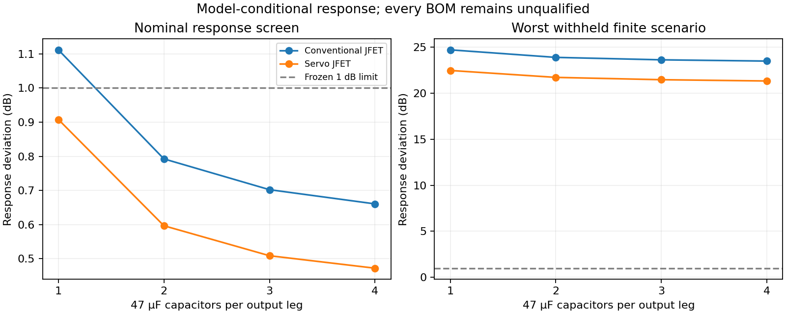

# Robust optimization research — 9 October 2026

M100 Meridian MIC-34-M/MIC-34-C, Arienne Audio Flat K47 Cardioid/Omni K47FRB, realistic P48. **All implementations remain unqualified.** This is restricted, model-conditional response optimization: the prerequisite audit found no complete validated semiconductor/noise/process set permitting an architectural performance ranking. No production topology, PCB or prototype is selected. No purchase, supplier contact, licence acceptance or external publication occurred.

[Contract](../CONTRACT.md) · [specification](../spec/microphone_spec.yaml) · [capsule uncertainties](../spec/capsule_model.yaml) · [model validity](device_model_validation.md) · [first batch](first_architecture_batch.md) · [dated decisions](robust_optimization_decisions.md). Physics/measurements → SPICE → tests → numerical optimization → engineering reasoning → LLM intuition.

## Prerequisites and scope

JFE150 and authored BC846B permit falsifiable nominal hypotheses within the library’s documented discrepancies, not a production-bounded response/noise prediction. OPA197’s grounded small-signal agreement does not validate these floating integrations. Carrier ordinary AC/stationary-noise objectives are blocked. `noise`, `distortion`, `headroom`, `loading`, `balance`, `drive`, `current` and `complexity` remain separate objective interfaces; missing behavior prerequisites block the corresponding optimization axis. No weighted engineering/cost winner score exists. Legacy noise optimization is restricted to the ideal infrastructure fixture.

The active numerical axis is maximum response deviation over nominal and two supply/feed training scenarios. DC current, positive rail/polarization and energy closure are hard feasibility gates; each trained scenario must also satisfy the unchanged 1 dB response limit before a proposal can be called screen-feasible. Search from outside that region uses response itself, without an arbitrary weighted penalty. No safe capsule voltage, absolute system noise, polar pattern or mechanical SPL rating is inferred.

## Budget, parameters and termination

[Predeclared plan](../optimization/robust_plan.yaml) gives every one of six mechanisms 12 unique design-vector evaluations, three scenarios each. Prerequisite/integration holds leave unused budget visible. Sources and every implementation file freeze before each run; individual trials never edit canonical parents. [Batch plan](../results/optimization_batches/20261009T090126Z_4735cd2a/plan.json) and [search index](../results/optimization_batches/20261009T090126Z_4735cd2a/search.json) preserve the actual allocation.

Bounds: JFET output C 47–188 µF per leg; CMOS guard uses the same output bracket, CMOS feedback 50–200 pF, BJT feedback 100 pF–100 nF. The plan records physically motivated current/bias/servo/guard/carrier hypotheses deferred on missing model/loop evidence. Design bounds are separate from unchanged acceptance/uncertainty ranges. Passive tolerances recenter around a continuous design without shrinking their relative widths; an independent regression rejects narrowing. No polarization parameter was optimized.

| Family | Evaluations / reserved | Scenario attempts / errors | Runtime s | Outcome |
| --- | ---: | ---: | ---: | --- |
| conventional_jfet | 12 / 12 | 36 / 0 | 8.63 | [evaluation_budget_exhausted](../results/runs/20261009T090126Z_robust_3a561a91/optimization.json) |
| unconventional_jfet | 12 / 12 | 36 / 0 | 8.92 | [evaluation_budget_exhausted](../results/runs/20261009T090135Z_robust_1f191c37/optimization.json) |
| bootstrap | 1 / 12 | 3 / 3 | 6.67 | [nominal_integration_failure_hold; remaining budget unused](../results/runs/20261009T090144Z_robust_63c4aec9/optimization.json) |
| charge | 1 / 12 | 3 / 3 | 2.88 | [nominal_integration_failure_hold; remaining budget unused](../results/runs/20261009T090150Z_robust_17f23af9/optimization.json) |
| no_fet | 12 / 12 | 36 / 0 | 7.11 | [evaluation_budget_exhausted](../results/runs/20261009T090153Z_robust_f022a8ef/optimization.json) |
| floating | 0 / 12 | 0 / 0 | 0.02 | [prerequisite_hold](../results/runs/20261009T090201Z_robust_8e649cf8/optimization.json) |

Three supported families used their whole budgets; none converged. The BJT result is “no feasible tested point”, not a proof that the entire value region is empty. CMOS holds preserve all six rejected scenario analyses. Seed 34047 generated numerical proposals. Further effort follows 20 explicitly reserved 50/25/15/10 slots: 10 improvement (eight discrete combinations plus two validation tasks), one of five underexplored tasks executed, zero of three new-concept tasks executed, two assumption-breaking hypotheses tested across combinations. Four underexplored and three new-concept tasks remain held on prerequisites; they were not reassigned to the favored family. All 14 catalogue families remain alive.

## Continuous proposals and withheld uncertainty

| Family | Baseline nominal deviation dB | Continuous C µF/leg | Continuous nominal / trained worst dB | Withheld corner worst dB | Independent random DC/AC passes |
| --- | ---: | ---: | ---: | ---: | --- |
| conventional_jfet | 1.117 | 188 | 0.6612 / 0.6696 | 23.55 | 16/16; 95% sampler interval [0.7941, 1] |
| unconventional_jfet | 0.9131 | 175.8 | 0.4771 / 0.4895 | 21.48 | 7/16; 95% sampler interval [0.1975, 0.7012] |

Each continuous proposal has a complete applicable suite, 40 additional documented DC/AC cases and 16 independent seed-84047 cases, with exact records linked below. Withheld cases include one-at-a-time capsule/interface endpoints, cross capacitance 0–5 pF, correlated combined passive/endpoints, full −10/+50°C model laws, documented resistor tolerance/TCR endpoints and complete JFE vendor weak/strong files. The vendor corners have known library limit failures: they are coupled proposal stresses, not certified manufacturer coverage. No BETA/VTO/BF/IS/noise terms were independently randomized, and the uncovered manufacturer/JFE bounds remain unchanged.

All finite adverse pass/fail specimens remain in worst/percentile summaries; missing/error analyses stay in denominators and invalidate robust objectives. Random draws are artificial uniform/log-uniform scenario designs, not measured production distributions. Binomial intervals describe only that sampler’s DC/AC screen; deterministic corners have no binomial interpretation. Nonparametric 95th-percentile metric intervals retain an unbounded upper endpoint at n=16; missing analyses would make the interval incomplete. Even 16/16 cannot establish 99.9% yield.

Random cases in this first batch are not pair-matched across implementations: differing passive counts consume different portions of the RNG stream. Their pass fractions must not be used to rank families or capacitor combinations. Common deterministic endpoints provide the controlled sensitivity comparison. All-requirement yield, semiconductor joint process/noise distributions, full-corner noise/distortion, loop return ratio/Nyquist, device SOA and physical evidence remain absent.

- conventional_jfet: [20261009T090337Z_3c7187fa](../results/runs/20261009T090337Z_3c7187fa/results.json) → [20261009T090344Z_f2f3eb75](../results/runs/20261009T090344Z_f2f3eb75/results.json); [withheld raw-case/interval record](../results/optimization_batches/20261009T090126Z_4735cd2a/continuous_conventional_jfet/validation.json).
- unconventional_jfet: [20261009T090403Z_bdcfe8b9](../results/runs/20261009T090403Z_bdcfe8b9/results.json) → [20261009T090412Z_5620861e](../results/runs/20261009T090412Z_5620861e/results.json); [withheld raw-case/interval record](../results/optimization_batches/20261009T090126Z_4735cd2a/continuous_unconventional_jfet/validation.json).

## Actual BOM combinations and full-suite outcomes

[Realizations](../results/optimization_batches/20261009T090126Z_4735cd2a/realization.json) preserve continuous proposal ancestry. Each leg uses one to four individual Panasonic EEU-FR1J470, 47 µF ±20%, 63 V radial parts, each with independent capacitance and explicit loss/leakage controls. [Primary observations](architecture_sources/robust_observations_2026-10-09.json) and [dated procurement](procurement/robust_parts_2026-10-09.yaml) separate manufacturer limits from indexed order observations.

FR-A DF ≤0.09 at 120 Hz/20°C gives a constant-series-loss stress of 2.540 Ω per 47 µF part; 63 V/29.6 µA gives 2.128 MΩ ohmic leakage stress. These conversions are explicit engineering scenarios, not a broadband ESR or real bias/temperature leakage/noise model. Each branch includes resistor Johnson noise in SPICE; dielectric/voltage/aging/excess-noise laws and layout inductance remain unknown. Temperature/TCR cases do not cure those gaps. Procurement/build qualification stays held.

| Realized child | Parent niche | 47 µF per leg | Nominal deviation dB | Delta from continuous parent dB | Withheld worst dB | Random passes /16 | Installed components | Priced electronics net EUR scenario |
| --- | --- | ---: | ---: | ---: | ---: | ---: | ---: | ---: |
| [candidate_0016](../candidates/candidate_0016/bom.yaml) | conventional_jfet | 1 | 1.112 | 0.4507 | 24.69 | 13 | 46 | 7.71 |
| [candidate_0017](../candidates/candidate_0017/bom.yaml) | conventional_jfet | 2 | 0.7924 | 0.1312 | 23.87 | 13 | 48 | 8.51 |
| [candidate_0018](../candidates/candidate_0018/bom.yaml) | conventional_jfet | 3 | 0.7022 | 0.04098 | 23.61 | 14 | 50 | 9.31 |
| [candidate_0019](../candidates/candidate_0019/bom.yaml) | conventional_jfet | 4 | 0.6606 | -0.0006817 | 23.47 | 16 | 52 | 10.11 |
| [candidate_0020](../candidates/candidate_0020/bom.yaml) | unconventional_jfet | 1 | 0.9079 | 0.4308 | 22.45 | 8 | 66 | 9.89 |
| [candidate_0021](../candidates/candidate_0021/bom.yaml) | unconventional_jfet | 2 | 0.5965 | 0.1194 | 21.7 | 12 | 68 | 10.69 |
| [candidate_0022](../candidates/candidate_0022/bom.yaml) | unconventional_jfet | 3 | 0.5087 | 0.03157 | 21.45 | 7 | 70 | 11.49 |
| [candidate_0023](../candidates/candidate_0023/bom.yaml) | unconventional_jfet | 4 | 0.4721 | -0.005013 | 21.31 | 8 | 72 | 12.29 |
| [candidate_0024](../candidates/candidate_0024/bom.yaml) | no_fet | series Cf | 32.82 | unknown | 35.79 | 0 | 46 | 6.45 |

Every child receives the full 14-check suite plus seed-94047 DC/AC validation; all remain failed or incomplete. Individual tests/statuses, missing evidence, exact device hashes, decks and all parent metric deltas are in the [evaluation index](../results/optimization_batches/20261009T090126Z_4735cd2a/evaluation.json). Full-suite metadata/spec/source cohort matches for all baseline/continuous/realized comparisons; the earlier optimizer cohort differs because realization sources were added between idle phases. No ideal-parent result is attributed to a BOM child.

The series-feedback BJT child candidate_0024 preserves its fixed 500 kΩ reset and adds a documented 100 pF C0G in series with the original 100 nF, including DF/IR controls. It is a budgeted structural hypothesis, not a threshold change, trimming or blanket no-FET rejection. Its exact current/noise/nonlinear/process limitations stay in its record.

## Family-specific implications and next experiments

1. Conventional JFET: output-capacitance tuning improves the modeled LF response; finite output impedance/balance, noise-model validity and nonlinear/startup failures still prevent advancement. Low capsule-leakage-resistance stress sharply defeats response. Measure/validate the capsule leakage and the JFE operating point under that load before extending value search. Keep the filtered-input niche as a research representative.

2. Servo JFET: lower nominal/trained response deviation does not establish better robustness. Common low-leakage and parasitic endpoints expose servo/bias sensitivity; complete audio/DC return-ratio and bias-authority controls are more informative than another resistor search. Its distinct niche is retained.

3. BJT-only charge: the best tested continuous feedback C is about 7.088 nF, with trained deviation 8.457 dB. Fixed reset/base-current authority, charge gain and finite-loop loading remain coupled limiting hypotheses. Retain the series-capacitor child’s actual failure; independently test transfer with analytic reset/charge oracles and obtain bipolar 1/f/current-noise evidence before further structural work.

4. Guarded CMOS and CMOS charge: stop numerical value tuning on the repeatable integration failure. The fastest useful experiment is a separate realistic floating-rail macro DC/current/common-mode harness, preserving the current failed integrations and manufacturer models. No physical-family rejection follows.

5. Carrier: preserve deterministic sideband controls, failed P48 integration and all unscreened feature holds. Establish physical oscillator/mixer power and validated periodic stochastic noise/extraction before comparable objective search. Ordinary stationary SPICE noise would be incompatible evidence.

Cross-family response order is uncertainty-sensitive: servo has the smaller nominal deviation, whereas individual parasitic/load endpoints and different artificial draws can change the apparent order. The shared low-leakage endpoint fails both. These are model sensitivity observations, not a supported production ranking. No single production winner is declared.

## Procurement, patent and physical gates

Use one capsule for one finished microphone. Count every installed capacitor and unavoidable pack excess, retain intended quantities, retail MOQ1 and indexed freshness separately from the manufacturer’s 5000-piece packaging. New capacitor stock observation is four months old and live retrieval failed. Exact lead/dispatch, some existing semiconductor/passive orderability, TME shipping, tax basis and import/payment fees remain unresolved.

All confirmed German delivered totals remain **null**. Priced net electronics subtotals use documented quantity-one shelf observations as conservative scenarios; extra parallel parts cost EUR0.40 net each in that scenario. Parent EUR25/29.75 shipping-tax alternatives apply once to the DigiKey basket, not once per part. Unknown parts/other seller shipping/fees are not zero. Capsule, body, PCB, XLR/protection and mechanics are excluded. No numerical spending cap, hypothetical bulk price or cost/performance scalar is introduced. Different quantities are alternatives, never a comparison-purchase bundle.

[New candidate-linked patent flags](patents/robust_optimization_2026-10-09.yaml) carry original affected features, circuit hashes, ancestry, DE/applicable EP scope and prototype/manufacture/build-publication holds. Claims and official status remain unscreened; no blocking claim or legal clearance is invented. Parallel/series passives and numerical values do not establish a design-around. Required claim/territory/current official-status review and professional resolution of material uncertainty precede any held gate. No prototype or implementation publication is authorized.

Evidence states remain separate: nominal DC/AC screen feasibility demonstrated for some proposals; finite scenario failures demonstrated; statistically supported manufacturing evidence absent; physical qualification absent. Safe capsule polarization, acoustic noise/overload/polar patterns and MIC-34-M/MIC-34-C physical variant behavior remain unknown.

## Checks and preservation

57 laboratory regressions passed before this batch, including missing-noise/periodic gates, adverse specimens, strict budgets, unchanged capsule uncertainty, design-tolerance non-narrowing, complete coupled corner rendering and an independent parallel-capacitance oracle. One early 51-pass/one-failure verification and the repaired successors remain; an initial driver import failure is preserved in [its probe](probes/robust_driver_import_2026-10-09/failure.log). [Integrity](robust_optimization_integrity_2026-10-09.json) and [private recovery receipt](robust_optimization_preservation_2026-10-09.json) record final hash, inventory, restore and repository checks.

Original failures, raw data, seeds, parent links and exact source/model/spec cohorts are preserved. Archive/Pareto views retain per-cohort response/current niche representatives without promoting unvalidated noise/yield or incomplete cost into production champions. Independent persistent backup coverage and 89 declared missing legacy source originals remain incomplete; local capture/restore is recovery evidence only.

