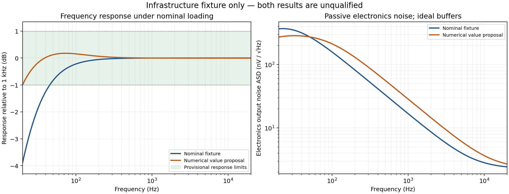

# M100 Meridian: initial research environment and evidence report

Date: 2026-10-05. Scope: **Phase 0–2 foundation**, with initial Phase 4 concept proposals and a numerical-workflow control. No production topology or prototype has been selected.

The workspace now runs real ngspice analyses, records complete evidence, rejects incomplete qualification, performs bounded numerical value search and preserves architectural niches. **22 independent regression checks pass.** Both final fixture evaluations finish all their SPICE jobs successfully; both fail engineering qualification. The eligible Pareto front and champion registers are correctly empty.

## What is executable

- First-order two-diaphragm electrical capsule model, nonlinear charge law and a linearized electronics-distortion mode.
- Loaded P48 supply, separate feed resistors and mismatches, cable/shield resistance and capacitance, AC-coupled preamp impedance and mismatch.
- Fourteen named engineering checks: operating point, response, noise, distortion, headroom, output impedance, balance, P48, temperature, semiconductor corners, Monte Carlo, loading, startup and stability. Some remain explicit incomplete screens, as detailed below.
- Noise integration with unweighted and A-weighted results and separate bias, polarization, power, output and capsule-leakage-surrogate contributions; H2–H10 spectra and coherent settling checks.
- SciPy differential evolution, parameter bounds and numerical constraints, raw trial preservation, full-suite re-evaluation and controlled parent comparisons.
- Experiment snapshots, source/specification hashes, exact simulator decks, raw files, failure logs, software versions, seeded uncertainty scenarios and strict result status handling.
- A quality-diversity archive, separate novelty descriptors, structural child registration, exploration allocation and a bounded evaluator for supplied Engineer netlists.
- A measurement interchange contract and comparison adapter, with a [synthetic adapter smoke check](../results/reports/measurement_adapter_smoke.json). No physical data have been collected.

The local runtime is ngspice 47 and Python 3.12.14 with pinned NumPy/SciPy/pandas/Matplotlib/PyYAML/pytest. It is installed within the workspace. The [README](../README.md) contains commands, bootstrap details, platform dependencies and evidence contracts. No system package, PCB tool or background AI service is required.

## Capsule evidence and uncertainty

The [current manufacturer page](https://store.arienneaudio.com/microphone-capsules/20-26-arienne-audio-flat-k47-microphone-capsule.html#/12-options-cardioid_omni) identifies the Flat K47 Cardioid/Omni K47FRB, modified tuning and changed manufacturing facility. It does not supply the electrical/mechanical data needed to qualify this microphone. A different regular K47's advertised capacitance is not transferred to this model.

| Property | Model entry | Evidence status |
| --- | --- | --- |
| Product and cardioid/omni options | Flat K47 K47FRB | Manufacturer specification |
| Historical combined capacitance | 120–150 pF | Unmeasured community estimate; no current-batch guarantee |
| Front and rear capacitance | 70 pF nominal per side; 45–100 pF each | Assumed exploratory brackets; independent/correlated behavior unresolved |
| Sensitivity at 60 V normalization | 20 mV/Pa nominal; 5–40 mV/Pa | Assumed, not measured |
| Polarization normalization | 60 V | Mathematical reference only |
| Polarization simulation envelope | 20–70 V | Assumed numerical exploration, not a hardware rating |
| Maximum safe polarization | Unknown | Requires applicable manufacturer data or qualified characterization |
| Leakage | 1 TΩ nominal; 1 GΩ–100 TΩ | Assumed humidity/contamination envelope; not a production distribution |
| Electrode/case parasitic | 2 pF nominal; 0.5–10 pF | Assumed |
| Front/rear stray | 0.5 pF nominal; 0–5 pF | Assumed |
| Mechanical noise, overload and angular response | Unknown | Not established by this electrical model |

The [capsule specification](../spec/capsule_model.yaml) explicitly distinguishes manufacturer information, third-party estimates, assumptions and unknowns. The [source register](sources.yaml) links the historical estimate and records limits of applicability. Nominal values are scenario anchors, not probability means inferred from production samples.

The charge law is `Q=C0(1+k·p)V`, with `k=Sref/Vref`, imposed linear compliance and current `I=dQ/dt`. A scaled observer using a native capacitor realizes this law. Gear-2 integration passes analytical AC/transient agreement and timestep-refinement regressions. Pressure is a separate virtual port; no capsule acoustic polar pattern is inferred. Linearized mode uses the actual simulated DC polarization for electronics THD. Mechanical distortion, acoustic thermal noise, electrostatic softening, pull-in and pressure overload are absent. No system self-noise or maximum-SPL claim follows from these runs.

## P48 evidence and environment

The [IEC official catalogue](https://webstore.iec.ch/en/publication/30762) identifies IEC 61938:2018 edition 3; its catalogue stability date is 2030. The public preview does not include the full phantom-power clauses. The [SCHOEPS manufacturer manual](https://schoeps.de/fileadmin/user_upload/user_upload/Downloads/Bedienungsanleitungen/Schoeps_Manual_V4_U_DE_1388740809.pdf) supports the public P48 summary of 44–52 V, nominal 6.8 kΩ feeds, pair matching below 0.4% and maximum total microphone current 10 mA.

Absolute feed tolerance deliberately retains ±20% legacy coverage from that manual. An uncontrolled transcription of the newer standard suggests ±10%; this is not treated as authenticated. The 7 mA preferred-current target and 0.8% conductor-current condition are provisional pending controlled section 9.4/Table 6 verification. The model therefore supports research screening, **not an IEC compliance declaration**. These distinctions are recorded in [design constraints](../spec/design_constraints.yaml).

Nominal cable length is 10 m, with 0–100 m application scenarios and a separately recorded 300 m stress envelope. Nominal effective differential capacitance is 100 pF/m, while its direct and shield components are assumed. Preamp differential impedance is 2 kΩ nominal, 1–10 kΩ application scenarios, with 600 Ω stress cases and ±5% leg mismatch. Temperature screens span −10 to +50 °C. A lumped cable model cannot establish RF behavior.

## Frozen provisional requirements

Electronics targets are ±1 dB from 20 Hz to 20 kHz, unweighted EIN ≤1 µV RMS, conditional electronics noise ≤4 dBA, THD ≤0.01% at 1 Pa and ≤0.5% at the 135 dB pressure stimulus, output impedance ≤200 Ω, impedance mismatch ≤1%, HF peaking ≤3 dB and cold-start settling ≤5 s. Total current is limited to 10 mA. Inherited 7 dBA system noise and 135 dB SPL aspirations remain contingent on capsule measurements.

These are research requirements, not manufacturer promises. No threshold or uncertainty range was relaxed to accommodate failures. The sole specification amendment corrected YAML scientific-exponent typing without changing numeric values; [amendment record](specification_amendments.md). The frozen specification hash is `f5201295bef7855bced5157cf9727f95d057c2b17589f9f55b8fd6fb17445bbd`.

## Actual sanity-fixture results

The [plain netlist](../candidates/fixture_0001/circuit.cir) is an **ideal, noiseless differential-buffer infrastructure fixture**, with a passive P48 harvest/load network. Ideal active sources do not draw realistic audio-driver power or clip. Its current, THD and headroom screens cannot qualify any real architecture. It is ineligible by construction.

The final [nominal record](../results/runs/20261005T121311Z_f11a711a/results.json) and [value-proposal record](../results/runs/20261005T121440Z_8f1bc311/results.json) use identical specification, model, test and source hashes. Each preserves 68 simulator jobs with decks/logs/raw evidence. All jobs complete; qualification failures below are retained.

| Metric | Nominal fixture | Numerical value proposal |
| --- | ---: | ---: |
| Passive harvest current | 2.751 mA | 2.751 mA |
| Loaded internal rail | 38.508 V | 38.508 V |
| Simulated capsule polarization | 38.462 V | 37.888 V |
| Maximum audio response deviation | 3.882 dB | 0.994 dB |
| Electronics unweighted EIN, conditional | 6.784 µV RMS | 7.187 µV RMS |
| Electronics unweighted equivalent pressure | 529.1 µPa RMS | 569.1 µPa RMS |
| Electronics A-weighted noise, conditional | 17.14 dBA | 21.50 dBA |
| Worst differential output impedance | 152.1 Ω | 114.1 Ω |
| Worst diagonal impedance mismatch | 22.49% | 37.65% |
| Cold-start settling to 1% | 1.318 s | 1.978 s |
| DC/AC scenario screening | 0/16 pass | 15/16 pass |
| Scenario response median | 3.085 dB | 0.630 dB |
| Scenario response 95th / 99th percentile | 3.614 / 3.630 dB | 0.925 / 1.018 dB |
| Scenario response worst observed | 3.634 dB | 1.041 dB |

Noise values integrate 20 Hz–20 kHz, with pressure and EIN conditional on the assumed capsule transfer. Capsule mechanical noise is excluded; no semiconductor noise model exists in this ideal fixture. Noise-power component sums close to total simulated noise within numerical precision. The scenario pass counts cover only initial DC/AC screens; **they are not manufacturing yield or all-requirement pass rates**.

The optimizer varied bias resistance, polarization resistance and output coupling capacitance within declared bounds. [202 recorded trials](../results/runs/20261005T114342Z_optimization_c7e7091b/trials.json) produced a proposal of 16.317 GΩ, 24.447 MΩ and 99.286 µF, respectively. The iteration budget expired before the optimizer's convergence criterion; global optimality is not claimed. Initial two-parameter and shorter searches failed feasibility and remain recorded.

The proposal improves nominal response and output impedance but worsens noise, impedance balance and startup settling. Its P48 current/response screens pass, yet realistic low-impedance output-load stress cases still fail response. The full suite rejects it. This verifies the optimizer-to-test-to-archive workflow and demonstrates why one-axis success cannot override other requirements. The current optimizer is a **nominal constrained control**; robust high-percentile/worst-case optimization is future work.

| Engineering check | Nominal | Proposal |
| --- | --- | --- |
| operating_point | pass | pass |
| frequency_response | fail | pass |
| noise | fail | fail |
| distortion | pass | pass |
| headroom | pass | pass |
| output_impedance | pass | pass |
| balance | fail | fail |
| phantom_supply | fail | pass |
| temperature | fail | pass |
| semiconductor_corners | incomplete | incomplete |
| monte_carlo | incomplete | incomplete |
| loading | fail | fail |
| startup | pass | pass |
| stability | fail | fail |

Passing distortion here validates the numerical harmonic extractor against ideal behavior. The headroom result is a right-censored lower bound at 112.468 Pa RMS and 1 kHz, with no observed clipping boundary; it is not a real microphone's maximum SPL. Temperature pass covers this ideal electrical network, not unknown capsule or semiconductor temperature laws. The stability check fails cable/load stress and has no return-ratio/Nyquist evidence; low HF peaking alone does not prove stability.

The [verification record](../results/verification/20261005T121220Z_2792e0f0/verification.json) and its `junit.xml` preserve 22 passing software/physics regressions, raw controls and matching final source manifests. Controls include loaded P48 analytic behavior, charge-model AC/transient agreement, capacitance extraction, output-impedance deembedding, component-noise accounting including a generic BJT parser control, harmonic timestep refinement, specification integrity, incomplete-result rejection, structural novelty and diversity retention. A generic BJT control is not a qualified production device model.

## Diversity and research memory

[22 Inventor concepts](../search/concepts.yaml) cover all [14 required architectural families](../search/families.yaml). Twenty avoid a conventional JFET voltage-buffer input; multiple proposals borrow charge amplifiers, electrometer guarding, capacitance bridges, low-current transimpedance sensing and sensor-interface mechanisms. Each specifies the sensed quantity, loading, DC bias, gain, balanced output, likely noise/distortion, fatal flaw and fastest falsification experiment. The [cross-domain register](cross_domain/mechanisms.md) links primary application reports, datasheets and research.

Concepts are **proposals, not explored or validated circuits**. The Inventor proposes; the Engineer must preserve each defining mechanism while constructing a viable netlist; simulation decides. One charge-amplifier concept has an [Engineer handoff](../search/proposals/concept_0010/engineer_task.md). No nonideal research or benchmark netlist is implemented yet. The bounded search loop correctly returns `awaiting_engineer_netlists` instead of manufacturing performance claims.

The [archive](../results/archive.json) retains unsuccessful experiments and architectural niches. [Novelty](../search/novelty.py) is separate from performance; a value-only change is not a new architecture. Pareto comparisons require complete metrics and matching source/specification/backend cohorts. [Rejected ideas](rejected_ideas.md), [discoveries](discoveries.md) and the [experiment log](experiment_log.md) preserve implementation failures and numerical lessons, including a fresh [behavioral-derivative AC failure reproduction](probes/ddt_ac_reproducer/results.json). One run was invalidated by a concurrent proposal export; it was preserved and repeated with stable sources. A final reporting audit also caught adverse completed scenarios being excluded from metric percentiles. Corrected summaries include all finite completed pass/fail cases, explicitly count missing/error metrics and retain failures in the pass denominator. The final runs above use the corrected suite; earlier aggregate percentiles are superseded, with original raw cases preserved.

## Evidence needed before later phases

1. Phase 3: current, documented semiconductor types, model licences, manufacturer limits, noise/temperature behavior and defensible populations; then a strong fairly optimized no-selection JFET reference and several distinct controls.
2. Phase 4–7: Engineer netlists for diverse concepts, structural search, robust optimization, passive/semiconductor tolerance and correlation populations, full noise/distortion/environment coverage, meaningful loop injection and stability analysis, device power/SOA and statistically supported all-requirement yield. Current scenario Monte Carlo is only a screen.
3. Capsule characterization: safe polarization and lead isolation first; calibrated front/rear capacitance/parasitics, sensitivity/spectra, leakage versus humidity/temperature, noise/overload and angular response with the intended headbasket. Replace assumed model parameters without changing the software architecture.
4. Phase 8: the [patent track](patents/README.md) is prepared but has no screened patent claims yet. Relevant jurisdictions, priority/status/claims and uncertain cases require separate documented research; no freedom-to-manufacture conclusion is made.
5. Phase 9–10: compare several fundamental families before selecting prototypes; add RF/ESD/protection/humidity, connection transients and PCB parasitics; collect calibrated measurements through the [interchange](../measurement/README.md), compare with simulation and revise models from evidence.

Project-authored software/models are MIT licensed. Third-party material retains its own terms. Hardware publication licensing and vendor-model redistribution review remain to be resolved before a mature open-hardware release. No parts were purchased, suppliers contacted, PCB generated or physical prototype authorized by a simulated passing screen.
